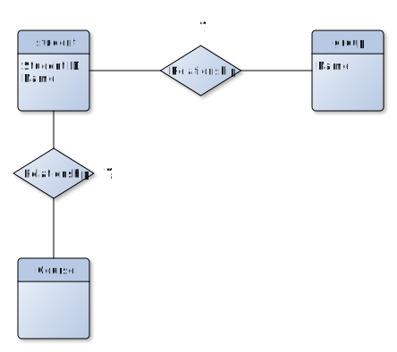

# Databases Systems EX2

## Prepare

- Start your MySql database, for example, with docker:

  ```bash
  docker run --name wsb-mysql \
     -e MYSQL_ROOT_PASSWORD=nomoresecret \
     -p 3306:3306 \
     -d mysql:8
  ```

- Open your MySql workbench

## Design your database

Imagine, that you need to create a database about students and courses:

1. Student
2. Student Group
3. Courses

Questions:

1. What would be the relationships between them?
2. How to connect different entities between each other?

Let's do together a [Entity-Relationship diagram](https://en.wikipedia.org/wiki/Entity%E2%80%93relationship_model):



## Create your own database

```sql
create database students;
```

```sql
CREATE TABLE student (
  ID INT NOT NULL AUTO_INCREMENT,
  NAME CHAR(20),
  UNIVERSITY_ID CHAR(30),
  GROUP_ID INT,
  PRIMARY KEY (ID)
);

CREATE TABLE student_group (
	ID INT NOT NULL AUTO_INCREMENT,
	NAME CHAR(20),
	PRIMARY KEY (ID)
);

CREATE TABLE course (
  ID INT NOT NULL AUTO_INCREMENT,
  NAME CHAR(40),
  YEAR CHAR(4),
  PRIMARY KEY (ID)
);

CREATE TABLE attending_course (
  ID INT NOT NULL AUTO_INCREMENT,
  ENROL_DATE DATE,
  COURSE_ID INT,
  STUDENT_ID INT,
  GRADE FLOAT,
  PRIMARY KEY (ID)
);
```

```sql
INSERT INTO student_group (NAME) VALUES ("Group A");
INSERT INTO student_group (NAME) VALUES ("Group B");
INSERT INTO student_group (NAME) VALUES ("Group C");

select * from student_group;

# how to prevent somebody using the same name?
#
# Check what UNIQUE KEY is and add it to the table after completing inserting data.
```

```sql
# group A
INSERT INTO student (NAME, UNIVERSITY_ID, GROUP_ID) VALUES ("Maria",  "12", 1);
INSERT INTO student (ID, NAME, UNIVERSITY_ID, GROUP_ID) VALUES (2, "Jane",   "23", 1);
INSERT INTO student (NAME, UNIVERSITY_ID, GROUP_ID) VALUES ("Anna",   "34", 1);
INSERT INTO student (NAME, UNIVERSITY_ID, GROUP_ID) VALUES ("Monika", "44", 1);

# group B
INSERT INTO student (NAME, UNIVERSITY_ID, GROUP_ID) VALUES ("Tom",    "54", 2);
INSERT INTO student (NAME, UNIVERSITY_ID, GROUP_ID) VALUES ("Natalia","64", 2);

# group C
INSERT INTO student (NAME, UNIVERSITY_ID, GROUP_ID) VALUES ("John",   "94", 3);

select * from student;
```

```sql
INSERT INTO course (NAME, YEAR) VALUES ("Databases", "2021");
INSERT INTO course (NAME, YEAR) VALUES ("Python", "2022");
INSERT INTO course (NAME, YEAR) VALUES ("Machine Learning", "2021");

select * from course;
```

```sql
# who enrolled to databases:
INSERT INTO attending_course (ENROL_DATE, COURSE_ID, STUDENT_ID, GRADE)
	VALUES ("2021-10-22", 1, 1, 3.5);
INSERT INTO attending_course (ENROL_DATE, COURSE_ID, STUDENT_ID, GRADE)
	VALUES ("2021-10-22", 1, 2, 5);
INSERT INTO attending_course (ENROL_DATE, COURSE_ID, STUDENT_ID, GRADE)
	VALUES ("2021-10-22", 1, 3, NULL);
INSERT INTO attending_course (ENROL_DATE, COURSE_ID, STUDENT_ID, GRADE)
	VALUES ("2021-10-22", 1, 4, 4.5);

# who enrolled to python
INSERT INTO attending_course (ENROL_DATE, COURSE_ID, STUDENT_ID, GRADE)
	VALUES ("2022-01-07", 2, 3, NULL);
INSERT INTO attending_course (ENROL_DATE, COURSE_ID, STUDENT_ID, GRADE)
	VALUES ("2022-01-11", 2, 4, NULL);

# who enrolled to ml
INSERT INTO attending_course (ENROL_DATE, COURSE_ID, STUDENT_ID, GRADE)
	VALUES ("2021-09-18", 3, 1, 5.0);
INSERT INTO attending_course (ENROL_DATE, COURSE_ID, STUDENT_ID, GRADE)
	VALUES ("2021-10-11", 3, 2, NULL);
INSERT INTO attending_course (ENROL_DATE, COURSE_ID, STUDENT_ID, GRADE)
	VALUES ("2021-09-18", 3, 6, 4.5);
INSERT INTO attending_course (ENROL_DATE, COURSE_ID, STUDENT_ID, GRADE)
	VALUES ("2021-09-18", 3, 7, 5.0);
```

Write SQL queries that:

1. Shows: `group name | student name | university id`
2. Present every course that students in group `Group B` attended
3. What courses attended students from `Group B` and not `Group C`.
4. The avg of student grades per group.
5. Who is the best student?
6. Which courses do not have students from `Group B`?

Tasks:

1. Try to add student with the same ID. Does it work? It must not. Please learn about `UNIQUE KEY` and apply it.

2. What if we delete a group? How to prevent it? Learn about `FOREIGN KEY` and apply it to the student table.

Hint: `ALTER TABLE table_name ADD CONSTRAINT constrain_name`.

## Cardinality

- 1-1
- 1-N
- N-M

## SQL Joins


## References

- [dataschool.com](https://dataschool.com/)
- [www.w3schools.com/sql](https://www.w3schools.com/sql)
